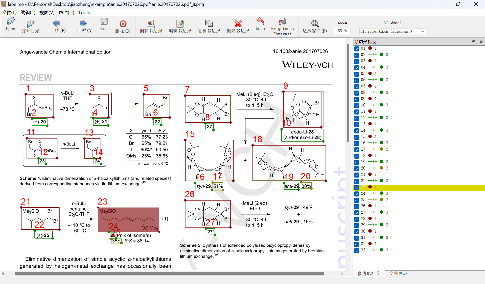
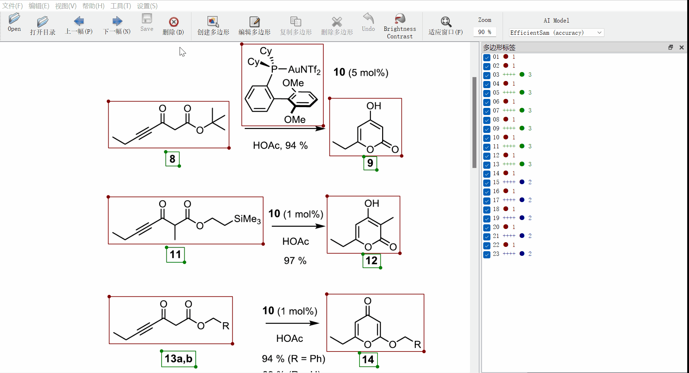
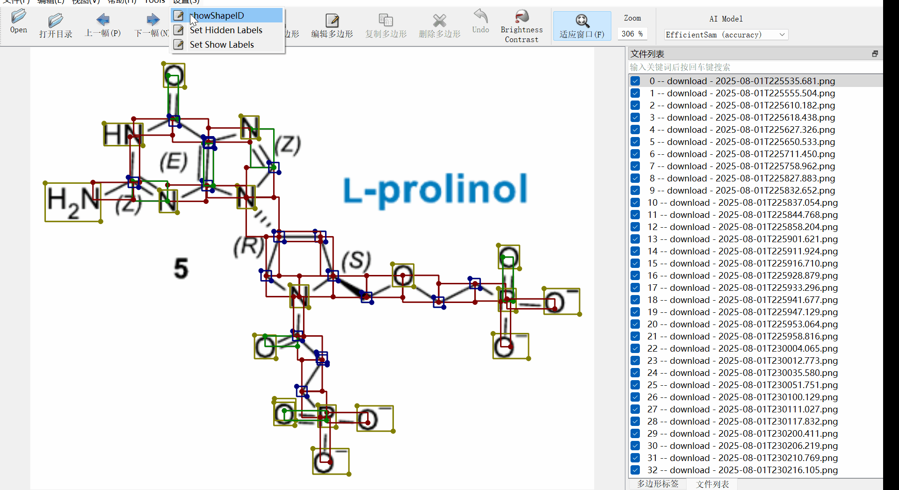
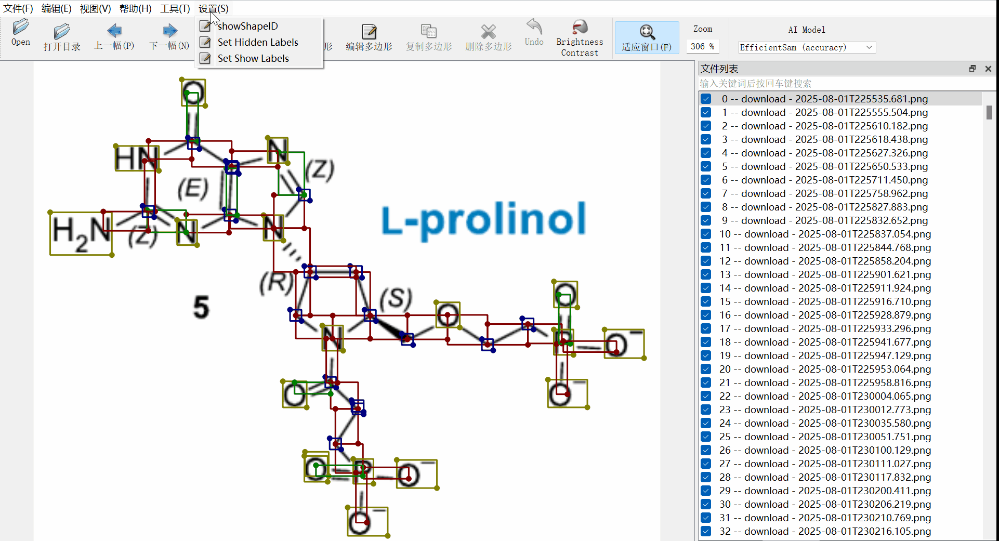
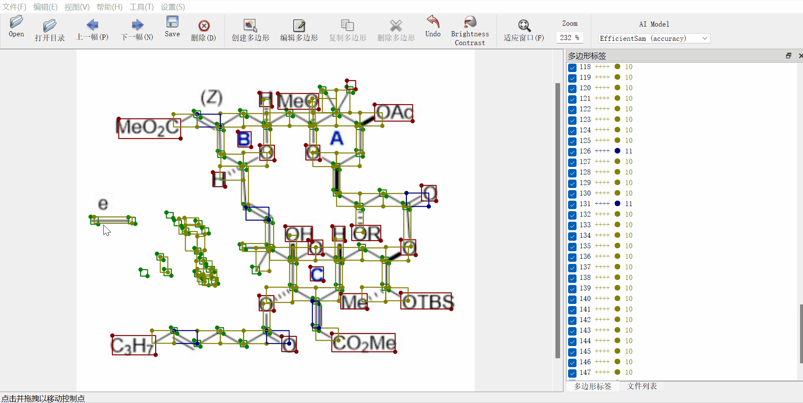

# ChemLabelMe

ChemLabelMe is a tool used for annotating and correcting the correspondence between chemical structures and chemical information (ID, chemical name, properties) in papers/patents, and has been used to assist in manual correction of the CarsiChemIE dataset (https://github.com/carbonsilicon-ai/CarsiChemIE ). This software is modified based on LabelMe (https://github.com/wkentaro/labelme ). After modifying the code, the following functions were mainly added: displaying annotation box IDs, displaying IDs in the label bar, indentation of non chemical structure labels in the label bar, double-click annotation boxes to achieve quick matching of chemical structure labels (1) with other labels, hidding/showing partial labels, etc. Compared to LabelMe, the modified software can improve the accuracy and efficiency of manual correction of chemical structure/information labels and their relationships.

 


# Example video
https://mwxiao.com/chemlabelme/chemlabelme.mp4  


# Main functions
## Displaying annotation box IDs   
The software has added the function of displaying Shape index, which is beneficial for different Shape positioning and matching operations. At the same time, modify the display of the label list by indentation of non chemical structure labels to display the matching situation between chemical structures and chemical information labels more clearly.  


## Quick matching of chemical structure labels (1) with other labels    
First, double-click the chemical structure label with the mouse, and then double-click the label of the chemical structure information to achieve fast matching between chemical structure and chemical information  
 with other labels")

## Hide labels
Hide some labels to facilitate checking the correctness of the remaining labels.  



## Show labels 
Only display partial labels to facilitate checking the correctness of specified labels  



## Batch delete shapes  
Batch delete shapes inside selected shape to speed up the correction process.  


# Usage   
## step 1  
```
conda create -n py38 python=3.8  
conda activate py38  
pip install labelme  
```  

## step 2  
Find the LabelMe folder (path to Anaconda3\envs\py38\Lib\site-packages\labelme), delete all files inside, and copy this code to that folder.  

## step 3  
run modified Labelme using Anaconda Prompt.   
```   
conda activate py38  
labelme   
```  


---  
# Chinese version of README   

ChemLabelMe是一个用于标注和校正论文/专利中化学结构与化学信息（编号、化学名、性质等）对应关系的小工具，已用于辅助CarsiChemIE数据集的人工校正（https://github.com/carbonsilicon-ai/CarsiChemIE ）。 本软件是基于LabelMe（https://github.com/wkentaro/labelme ）修改的，修改代码后，主要增加以下功能：显示标注框ID、标签栏显示ID、非化学结构标签在标签栏缩进、双击标注框实现化学结构标签（1）与其他标签的快速匹配、显示或隐藏部分标签等。 相对于LabelMe，修改后的软件可以提高人工校正化学结构/信息标签及其匹配关系的准确性和效率。

# 实例视频  
https://mwxiao.com/chemlabelme/chemlabelme.mp4  


# 主要功能
## 显示Shape的索引  
软件增加显示Shape索引的功能，这有利于不同Shape定位与匹配操作。同时修改标签列表的显示方式，将非化学结构标签缩进显示，更清晰地显示化学结构与化学信息标签的匹配情况。    


## 快速匹配化学-非化学标签    
首先鼠标双击化学结构标签，再双击化学结构信息的标签来实现化学结构与化学信息的快速匹配。  
 with other labels")

## 隐藏不显示部分标签  
隐藏部分标签以利于检查其余标签的正确性。   


## 仅显示部分标签  
仅显示部分标签以利于检查指定标签的正确性。     


## 批量删除标签  
批量删除选定Shape对象内的所有Shape对象，这样不用一个个删，在某些情况下可大大加快校正过程。  


# 用法  
## 步骤一  
创建Python 3.8环境，并安装labelme。 注：Python 3.10暂时会报错。  
```
conda create -n py38 python=3.8  
conda activate py38  
pip install labelme  
```  

## 步骤二  
找到LabelMe文件夹 (一般在Anaconda3\envs\py38\Lib\site-packages\labelme)，删除该文件夹所有文件，将本项目代码复制到该文件夹。  

## 步骤三   
通过Anaconda Prompt运行修改后的LabelMe。    
```   
conda activate py38  
labelme   
```   
